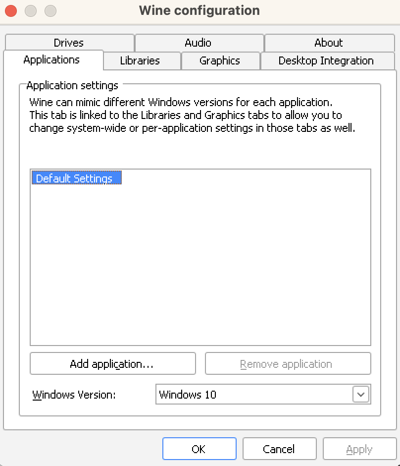

<p align="center">
  <a href="https://github.com/destin-v">
    
  </a>
</p>

# 📒 Description
<p align="center">
  
</p>

<p align="center">
  <a href="https://devguide.python.org/versions/">              </a>
  <a href="https://docs.github.com/en/actions/quickstart">      </a>
  <a href="https://black.readthedocs.io/en/stable/index.html">  </a>
</p>

<p align="center">
  <a href="https://github.com/destin-v/mac-wine-installer/actions/workflows/pre-commit.yml">  </a>
  <a href="https://destin-v.github.io/mac-wine-installer/src.html">                           </a>
  <a href="https://github.com/destin-v/mac-wine-installer/actions/workflows/pytest.yml">      </a>
</p>

Instructions for setting up Wine on Mac OS Ventura.  Wine is a piece of software that translates Windows calls into POSIX compliant calls making it possible to run Windows software on Linux and Mac systems.  Note that Wine is not a virtual machine which spawns a new operating system.  The Wine translation software allows you to run Windows executable natively on your native Linux or Mac OS.

# 🤖 Automatic Installation
A script has been provided to install the Wine software for Mac OS.  You will need a virtual environment with Python `3.10` or higher to run the script.  This has been tested on Mac OS Ventura and works.

```bash
conda create -n mac_wine_installer python=3.10
conda activate mac_wine_installer
git clone https://github.com/destin-v/mac-wine-installer.git
pip install poetry
poetry install
python src/main.py --help   # use to show commands
python src/main.py          # run with all default options
```

<figure>
    <p align="center">
    
    </p>
</figure>

<p align="center">
<b>The CLI automatic installer should be your first choice.</b>
</p>

# 👨‍💻 Manual Installation
1. Install [Homebrew](https://brew.sh).
   ```bash
   /bin/bash -c "$(curl -fsSL https://raw.githubusercontent.com/Homebrew/install/HEAD/install.sh)"
   ```

2. Make sure you have [xQuartz](https://www.xquartz.org) installed.

    ```bash
    brew install ––cask xquartz     # recommend going to website for latest version.
    ```

3. Install [Wine](https://wiki.winehq.org/MacOS).

    ```bash
    brew tap homebrew/cask-versions
    brew install --cask --no-quarantine wine-devel  # wine-stable (if you don't need the latest updates!)
    ```

> Note: My recommendation is that you use the `wine-devel` package because they have the latest updates.  However, if you don't need the latest update use the `wine-stable` package.

# 🍷 Configure Wine

After installing Wine make sure to setup the Wine configuration.  Depending on your hardware architecture you have to either use `wine` (32-bit) or `wine64` (64-bit).
```bash
wine64 winecfg  # here we assume you are on the 64-bit architecture
```

<figure>
    <p align="center">
    
    </p>
</figure>

<p align="center">
<b>The WineCfg will show up when you successfully install.</b>
</p>

# 💻 Install Windows Application
Search through the [Wine Application Database](https://appdb.winehq.org) for the Windows software you are trying to use.  If it is not listed here, it may not work.  Wine cannot translate all Windows calls into POSIX compliant calls.  Thus, some software will not work!

# 💥 Uninstalling
* If you need to uninstall remove the Homebrew cask as well as the local directory.
    ```bash
    brew uninstall --cask wine-devel
    rm -rf $HOME/.wine
    ```

* If you need to uninstall Windows applications you installed using Wine use the uninstaller:

    ```bash
    wine64 uninstaller
    ```
